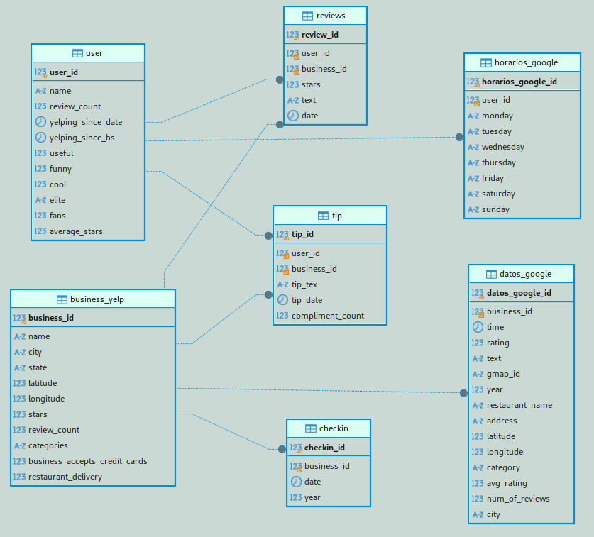

<h1 align="center">🍽️ Proyecto Final Henry - StarSight 🗺️</h1>

## **📋 Índice**

- [**📋 Índice**](#-índice)
- [**Integrantes**](#integrantes)
- [**Introducción a StarSight**](#introducción-a-starsight)
- [**Contexto**](#contexto)
- [**🚀 Desarrollo del proyecto**](#-desarrollo-del-proyecto)
- [**🌐 Alcance del proyecto**](#-alcance-del-proyecto)
- [**🎯Objetivos**](#objetivos)
  - [**🌟 Objetivos Comunes**](#-objetivos-comunes)
- [**📊 KPI´s:**](#-kpis)
- [**🔧 Flujo de Trabajo**](#-flujo-de-trabajo)
  - [1. ETL](#1-etl)
  - [Pipeline](#pipeline)
- [**Diagrama E-R**](#diagrama-e-r)
- [**DashBoard Interactivo de Restaurantes en Florida** 📊](#dashboard-interactivo-de-restaurantes-en-florida-)
  - [Caracteristicas Principales](#caracteristicas-principales)
  - [Requerimientos del Proyecto:](#requerimientos-del-proyecto)
  - [Ilustración](#ilustración)
- [**🔧 Metodología del Trabajo**](#-metodología-del-trabajo)
  - [1. **Sprint 1 - Comprensión del Negocio y de los Datos:**](#1-sprint-1---comprensión-del-negocio-y-de-los-datos)
  - [2. **Sprint 2 - Preparación de los Datos y Modelado:**](#2-sprint-2---preparación-de-los-datos-y-modelado)
- [**Conclusiones**](#conclusiones)

## **Integrantes**

- [María José Grecco](https://github.com/mpaezgrecco) - *Data Analist*
- [Esteban Parron](https://github.com/systemeap) - *Data Analist*
- [Santiago Mejía](https://github.com/SantiagoMejiaGuerra) - *Data Analist*
- [Joaquín Rubiolo](https://github.com/joarubiolo) - *Data Scientist*
- [Luis Gonzalez](https://github.com/lucho28) - *Data Engineer*

## **Introducción a StarSight**

En el sector de la industria gastronómica, las reseñas de los clientes en línea juegan un papel crucial en la reputación y el éxito de los negocios. La retroalimentación pública, visible en plataformas como *Yelp* y *Google Maps*, no solo influye en la percepción de los potenciales clientes, sino que también ofrece una fuente rica de datos para optimizar la experiencia del usuario y los servicios ofrecidos.

  

StarSight surge con el propósito de transformar estas opiniones en información valiosa para que los establecimientos puedan tomar decisiones informadas y orientadas a la mejora continua. Nos especializamos en la implementación de modelos de aprendizaje automático (ML) adaptados a las necesidades específicas de nuestros clientes en el mercado gastronómico, extrayendo patrones clave y recomendaciones accionables que impulsan el crecimiento y la satisfacción del cliente en este sector.
Con nuestro enfoque personalizado y analítico, StarSight se posiciona como el aliado estratégico de los negocios gastronómicos que buscan aprovechar los datos de reseñas en línea para diferenciarse en el mercado y mejorar su rendimiento.

## **Contexto**

Nuestro cliente nos ha solicitado un análisis enfocado en restaurantes en el estado de Florida, un mercado altamente competitivo donde las opiniones de los consumidores juegan un rol crucial. Este proyecto aprovechará las reseñas en línea para ofrecer insights estratégicos y recomendaciones prácticas, ayudando a nuestros clientes a mejorar la experiencia del cliente y fortalecer su posición en el mercado.

## **🚀 Desarrollo del proyecto**

Comenzamos identificando las diferentes problemáticas que enfrenta la industria gastronómica con servicio directo al consumidor final. Algunos puntos clave a tener en cuenta son:

- **Análisis de la percepción del cliente**: Interpretación de las impresiones que adquiere el usuario sobre la calidad, servicio u otros aspectos del negocio.
- **Predicción de tendencias de mercado**: Necesidad de anticiparse a cambios y adaptarse rápidamente a las nuevas formas de consumo.
- **Selección de ubicaciones estratégicas**: Identificación de los mejores lugares para abrir nuevos negocios o expandirse.
- **Personalización de la experiencia del usuario**: Fortalecer el vínculo con potenciales clientes a través de la personalización.
- **Alta competencia y mercado saturado**: Dificultad para el desarrollo natural de los negocios debido a la saturación del mercado.

Utilizamos diversas herramientas para abordar estas dificultades, considerando factores del mercado actual, y buscando oportunidades para fortalecer el negocio y evitar amenazas de la competencia.

<!-- Alcance section -->
## **🌐 Alcance del proyecto**

**Extracción de Datos:** Recopilación y utilización de datos provenientes de plataformas de reseñas como Google Maps y Yelp.

**Análisis de Datos:** Implementación de técnicas avanzadas de Análisis de Datos y Aprendizaje Automático para examinar las reseñas de los usuarios.
El análisis permitirá al sistema identificar tendencias y generar recomendaciones consistentes.

**Cobertura Geográfica:** Enfoque específico en los establecimientos gastronómicos ubicados en el estado de Florida en los Estados Unidos.

**Visualización y Sistema de Recomendación:** Desarrollo de una interfaz de usuario intuitiva que permita a los clientes seleccionar sus criterios para la búsqueda de restaurantes.
Presentación visual de los resultados de las recomendaciones.
<!-- objetivos section -->
## **🎯Objetivos**

1. Realizar un análisis exhaustivo del mercado gastronómico en el estado de Florida, aprovechando el valor de los datos para comprender el comportamiento de los consumidores y la competitividad del sector.

2. Buscar e identificar restaurantes de comida americana en el estado de Florida, utilizando técnicas de análisis de datos para obtener insights sobre su presencia y características en el mercado.

3. Evaluar oportunidades de crecimiento y expansión en el sector gastronómico mediante el análisis de distintos escenarios en el estado de Florida.

4. Desarrollar un modelo predictivo para optimizar la selección de áreas estratégicas para la apertura de nuevos restaurantes.

### **🌟 Objetivos Comunes**

1. **Extracción de datos desde la fuente:** Utilizar los datos proporcionadas de Yelp y Google Maps, así como la recolección de datos propia y el scrapping para obtener variables demográficas.

2. **Disponibilizar datos en la nube:** Implementar un proceso de carga incremental con servicios de Amazon Web Servise (AWS) para permitir el acceso a los datos desde nuestra plataforma.

3. **Limpieza de Datos:** Corregir valores atípicos, gestionar datos faltantes y normalizar los datos para garantizar su integridad antes del análisis.

4. **Automatización:** Automatizar en la medida de lo posible el proceso de extracción, transformación y carga (ETL) para mejorar la eficiencia y reducir los riesgos de errores manuales.

5. **Documentación:** Detallar exhaustivamente todo el proceso de ETL, incluyendo fuentes de datos, transformaciones realizadas y criterios de calidad aplicados, para facilitar la replicabilidad y el mantenimiento del proceso.
 <!-- KPI section -->
## **📊 KPI´s:**

1. **Aumentar el promedio de horas de operación:** 
* **Descripción**: Mide el promedio de horas semanales que operan los restaurantes de comida americana en Florida.

* **Objetivo**: Aumentar este promedio a 40 horas semanales en un periodo de 2 años.

$$
\mathrm{KPI} = \frac{\sum \text{Horas de operación}}{\text{Total de restaurantes}}
$$
 

2. **Aumento estandar de 4 estrellas:** 
* **Descripción**:Calcula el promedio de estrellas o calificación general recibida por los restaurantes de comida americana.
* **Objetivo**: Alcanzar un promedio de 4 estrellas en el transcurso de un año.

$$
\mathrm{KPI} = \frac{\sum \text{Calificación de estrellas}}{\text{Total de restaurantes}}
$$

 

3. **Incrementar el promedio de estrellas por ciudad:** 
* **Descripción**:Medir el promedio de estrellas o calificación general recibida por los restaurantes de comida americana en cada ciudad del estado de Florida.
* **Objetivo**: Incrementar este promedio a 4 estrellas para el próximo año.

$$
\mathrm{KPI} = \frac{\sum \text{calificacion de estrellas por ciudad}}{\text{Total de restaurantes}}
$$

 

<!-- flujo section -->
## **🔧 Flujo de Trabajo**

### 1. ETL 

Nuestra base de datos principal proviene de **Yelp** y **Google Maps**.
A continuacion podras encontrar la fuente de datos principal para la realizacion del proyecto: 

- [Dataset de Google Maps](https://drive.google.com/drive/folders/1Wf7YkxA0aHI3GpoHc9Nh8_scf5BbD4DA)
- [Dataset de Yelp!](https://drive.google.com/drive/folders/1TI-SsMnZsNP6t930olEEWbBQdo_yuIZF)

Al recibir los datos en bruto, se lleva a cabo un trabajo manual y estandarizado de ETL utilizando Python y las librerías pertinentes.Este proceso incluye la eliminación de columnas irrelevantes, desanidamiento de columnas si es necesario, manejo de valores nulos y duplicados, normalización de tipos de datos y nombres de columnas según un esquema estandarizado.
Posteriormente realizamos un **Análisis de Datos Exploratorio (EDA)** en el que identificamos las variables más relevantes dentro de los comentarios publicados, utilizando librerías como **Pandas** y **Numpy**.
El análisis proporciona una visión general del dataset, el cual es limpiado y procesado para obtener métricas básicas. 

  

  

Para poder guiarse en el proyecto, puede encontrar los ETL y EDA correspondientes en las carpetas de ./ETL_EDA_GOOGLE y ./ETL_EDA_YELP dentro de este repositorio, dentro de las cuales se encuentran los distintos elementos del dataset procesados y explorados para extraer la mayor cantidad de informacion posible. 

  

### Pipeline

1. Carga de Archivos CSV en S3 (Fuente de Datos)

El proceso comienza con la carga de archivos CSV en un bucket de Amazon S3. Estos archivos pueden provenir de múltiples fuentes de datos, ya sea de procesos manuales o automatizados que recolectan y transfieren datos a S3. Al centralizar la carga en S3, se proporciona un repositorio accesible y seguro para almacenar datos sin procesar.

2. Detección Automática de Nuevas Cargas

Se configura una notificación de eventos en el bucket de S3 que desencadena una función Lambda cada vez que se carga un nuevo archivo. Este evento de S3 puede ser programado para detectar únicamente cargas completas, evitando la activación prematura durante una carga en progreso.

3. Verificación de Archivos por Nombre

La función Lambda que se activa primero realiza una verificación en la base de datos MySQL en Amazon RDS. Consulta una tabla específica de registros de archivos para determinar si el archivo recién cargado ya ha sido procesado. Este paso es crucial para evitar duplicados y garantizar la integridad de los datos.

Estrategia Escalable: Puedes escalar este proceso creando funciones Lambda específicas para diferentes tablas de la base de datos. Esto permite que el sistema se adapte a un mayor número de tipos de datos y formatos de archivo sin necesidad de rediseñar todo el pipeline.

4. Invocación de Función Lambda para Procesamiento y Carga

Si la función Lambda de verificación determina que el archivo es nuevo, se activa una segunda función Lambda encargada de procesar y cargar los datos. Esta función accede al archivo en S3 y lo prepara para su inserción en la base de datos. Durante este proceso, se aplican ciertos controles para asegurar la integridad de los datos:

* Control de Duplicados: La función está diseñada para evitar la inserción de datos repetidos en la base de datos. Si encuentra registros que ya existen, los ignora o actualiza solo ciertos campos, garantizando que la información almacenada sea precisa y esté al día.
* Transformaciones de Datos: Si es necesario, los datos se pueden ajustar para que sean consistentes y estén listos para la carga.
* Validaciones Básicas: Se realizan comprobaciones rápidas para confirmar que los datos cumplen con las expectativas antes de cargarse.
De esta manera, la función asegura que solo se agreguen datos nuevos o actualizados, sin sobrescribir información valiosa de manera innecesaria. Al final, los datos ingresan a la base de datos en un estado óptimo, listos para ser utilizados en análisis y reportes.

5. Carga en la Base de Datos RDS (Destino de Datos)

La base de datos MySQL en Amazon RDS es el destino final de los datos procesados. Al usar una base de datos gestionada, se garantiza alta disponibilidad, recuperación ante fallos y escalabilidad. Además, se pueden optimizar las consultas mediante índices y particiones para mejorar el rendimiento de lectura y escritura.

6. Manejo de Errores y Monitoreo

Implementa un sistema de logging robusto en cada función Lambda para capturar detalles de errores y procesos. Puedes integrar AWS CloudWatch Logs para monitorear las funciones y recibir alertas en caso de fallos. Esto facilita la detección y solución de problemas, asegurando la continuidad del pipeline.

7. Escalabilidad y Flexibilidad

La arquitectura basada en funciones Lambda permite que el pipeline sea altamente escalable. Se pueden agregar nuevas funciones Lambda para manejar diferentes tipos de datos o tablas en la base de datos sin modificar la estructura principal del pipeline. Además, al trabajar con funciones sin servidor, la solución se escala automáticamente según la carga, lo que garantiza un uso eficiente de recursos y costos.

8. Optimización de Costos

Monitorea el uso de Lambda, S3 y RDS para mantener los costos bajo control. Considera la posibilidad de programar las funciones Lambda para ejecutarse con memoria y tiempo de ejecución optimizados y revisar las métricas de rendimiento de RDS para ajustar el tamaño de la instancia y las configuraciones de almacenamiento.

- **Demostracion carga incremental :**
  [Video demostracion](Imagenes/video.mp4)

## **Diagrama E-R**

  

<!--Dashboard PowerBI -->

## **DashBoard Interactivo de Restaurantes en Florida** 📊

  

Este proyecto consiste en un dashboard interactivo desarrollado en Power BI, diseñado para analizar y visualizar datos de restaurantes en Yelp y Google Maps. El dashboard muestra información clave, como la calificación de estrellas, la ubicación de los restaurantes por ciudad, y otros indicadores importantes de rendimiento (KPI) relacionados con la actividad de los usuarios. Los datos provienen de una base de datos de AWS y están diseñados para ofrecer insights sobre el estado de los negocios y la participación de los usuarios en la plataforma de Yelp y Google Maps.

### Caracteristicas Principales
El DashBoard consta de tres paginas con las siguientes funciones:

- **Indicadores Clave de Rendimiento:** Esta sección del dashboard presenta los KPI más relevantes para identificar la ubicación ideal para un nuevo restaurante en Florida.
- **Estado de los negocios en Florida:** Proporciona un análisis especifico de los restaurantes como saber cuantos locales estan abiertos y cuentos reciben tarjetas de credito en cada ciudad de Florida.
- **Resumen de interacciones y participación:** Visualiza el nivel de participación de los usuarios en diferentes años en el estado de florida, además se observa la cantidad de comentarios hasta el 2021 y su total de usuarios.

### Requerimientos del Proyecto:
- Power BI Desktop (necesario para cargar y visualizar el dashboard)
- Descargar el archivo de [Google_Yelp.pibx](https://drive.google.com/drive/folders/1VM61uOueptbLITQOVv21ClOmhPJxYNs5?usp=sharing) aqui 
- En caso de imprevisto con los datos descargar los Datasets ubicados en el ETL

### Ilustración 

  

<!-- metodología section -->
## **🔧 Metodología del Trabajo**
Para este proyecto, se implementará la metodología Scrum, la cual divide el trabajo en partes pequeñas y manejables llamadas "sprints". Cada sprint tiene una duración de dos semana, durante las cuales el equipo se enfocará en completar un conjunto específico de tareas. Al final de cada sprint, se llevará a cabo una reunión de revisión de sprint (sprint review meeting) donde se realizará una demostración de los entregables desarrollados, con el objetivo de recibir retroalimentación y ajustar la planificación para el siguiente sprint según lo aprendido. Además, se llevarán a cabo reuniones de seguimiento (Daily Standup) para discutir el progreso y abordar posibles inconvenientes. Este enfoque permite una adaptación continua a medida que el equipo avanza.
Detalles de los Sprints:

### 1. **Sprint 1 - Comprensión del Negocio y de los Datos:**
Duración: 2 semanas.
Objetivo: Comprender en profundidad el negocio y los datos involucrados en el proyecto.
Actividades:
- Revisión y análisis detallado de los requisitos del cliente.
- Investigación sobre las plataformas de reseñas como Google Maps y Yelp.
- Identificación de posibles fuentes de datos y su relevancia para el proyecto.
- Establecimiento de objetivos claros para el proyecto y definición de las métricas de éxito.

### 2. **Sprint 2 - Preparación de los Datos y Modelado:**
Duración: 2 semanas.
Objetivo: Preparar los datos y realizar el modelado necesario para el desarrollo del sistema de recomendación.
Actividades:
- Extracción de datos de las fuentes identificadas.
- Limpieza y preparación de los datos para su posterior análisis.
- Aplicación de técnicas de modelado de datos para generar insights preliminares.
- Identificación de posibles problemas o desafíos en los datos y su resolución.

## **Conclusiones**
1. El análisis del mercado gastronómico en el estado de Florida ha permitido identificar patrones de comportamiento de los consumidores y el nivel de competitividad entre los restaurantes de comida americana. Este entendimiento es clave para determinar cómo se distribuyen estos negocios, cuáles son sus características más comunes y qué tipo de consumidores atraen, lo cual resulta fundamental para la toma de decisiones estratégicas.
2. A partir de los datos obtenidos de Yelp y Google Maps, se logró identificar una gran cantidad de restaurantes de comida americana en Florida, así como analizar sus ubicaciones, popularidad y factores diferenciadores. Esto no solo aporta una visión general de su presencia en el mercado, sino también de las oportunidades y desafíos que enfrentan para captar y retener a los clientes en un sector tan competitivo.
3. El análisis de diferentes escenarios ha permitido evaluar áreas con potencial de crecimiento en el sector gastronómico de Florida. Este estudio revela zonas estratégicas donde la demanda de opciones gastronómicas podría estar insatisfecha, sugiriendo oportunidades para que nuevos restaurantes capturen un mercado desatendido y contribuyan a la diversificación del sector.
4. El desarrollo de un modelo predictivo facilita la identificación de áreas estratégicas para la apertura de nuevos restaurantes, optimizando los recursos y minimizando el riesgo de inversión. Con este modelo, es posible proyectar la probabilidad de éxito en distintas ubicaciones y orientar mejor las decisiones de expansión.
5. La implementación de un proceso de carga incremental en AWS asegura que los datos estén disponibles en la nube de manera segura y eficiente. Esto permite un acceso centralizado y facilita el análisis colaborativo, mejorando la agilidad en la toma de decisiones y optimizando el uso de los datos a lo largo del proyecto.
6. La automatización del proceso de ETL (Extracción, Transformación y Carga) ha mejorado significativamente la eficiencia del proyecto, al reducir los riesgos de errores manuales y optimizar el tiempo del equipo. Esta automatización también permite una mayor escalabilidad del proceso, facilitando futuras actualizaciones y expansiones de datos.
7. Durante el análisis inicial, el equipo mantuvo una constante flexibilidad para adaptarse a nuevos insights o descubrimientos en los datos, lo cual fue esencial para mantener la alineación con los objetivos del proyecto. Este enfoque permitió no solo cumplir con la visión inicial, sino también ajustar la dirección del proyecto para maximizar la satisfacción del cliente y la efectividad del equipo.

