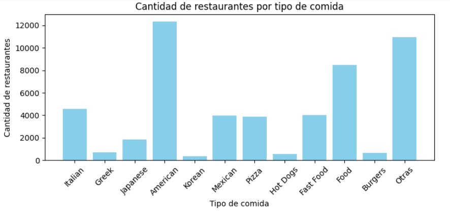
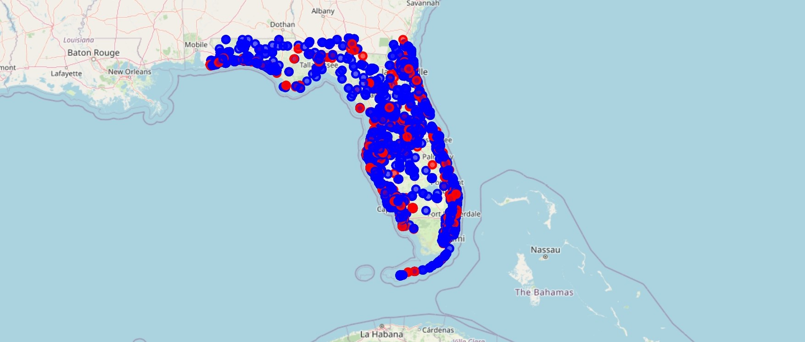
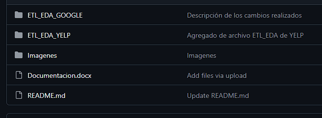

<h1 align="center">🍽️ Proyecto Final Henry - StarSight 🗺️</h1>

## ** 📋 Índice**

1. [Integrantes](#Integrantes)
2. [Introduccion a StarSight](#Introducción-a-StarSight)
3. [Contexto](#contexto)
4. [Desarrollo del proyecto](#Desarrollo-del-proyecto)
5. [Objetivos](#-objetivos)
6. [Lo que Hacemos](#Lo-que-Hacemos)
7. [Alcance del proyecto](#-alcance-del-proyecto)
5. [Nuestro Modelo](#Nuestro-Modelo)

## **Integrantes**

- [María José Grecco](https://github.com/mpaezgrecco) - *Data Analist*
- [Esteban Parron](https://github.com/systemeap) - *Data Analist*
- [Santiago Mejía](https://github.com/SantiagoMejiaGuerra) - *Data Analist*
- [Joaquín Rubiolo](https://github.com/joarubiolo) - *Data Scientist*
- [Luis Gonzalez](https://github.com/lucho28) - *Data Engineer*

## **Introducción a StarSight**

En el sector de la industria gastronómica, las reseñas de los clientes en línea juegan un papel crucial en la reputación y el éxito de los negocios. La retroalimentación pública, visible en plataformas como *Yelp* y *Google Maps*, no solo influye en la percepción de los potenciales clientes, sino que también ofrece una fuente rica de datos para optimizar la experiencia del usuario y los servicios ofrecidos.

  

StarSight surge con el propósito de transformar estas opiniones en información valiosa para que los establecimientos puedan tomar decisiones informadas y orientadas a la mejora continua. Nos especializamos en la implementación de modelos de aprendizaje automático (ML) adaptados a las necesidades específicas de nuestros clientes en el mercado gastronómico, extrayendo patrones clave y recomendaciones accionables que impulsan el crecimiento y la satisfacción del cliente en este sector.
Con nuestro enfoque personalizado y analítico, StarSight se posiciona como el aliado estratégico de los negocios gastronómicos que buscan aprovechar los datos de reseñas en línea para diferenciarse en el mercado y mejorar su rendimiento.

## **Contexto**

Nuestro cliente nos ha solicitado un análisis enfocado en restaurantes en el estado de Florida, un mercado altamente competitivo donde las opiniones de los consumidores juegan un rol crucial. Este proyecto aprovechará las reseñas en línea para ofrecer insights estratégicos y recomendaciones prácticas, ayudando a nuestros clientes a mejorar la experiencia del cliente y fortalecer su posición en el mercado.

## ** 🚀 Desarrollo del proyecto**

Comenzamos identificando las diferentes problemáticas que enfrenta la industria gastronómica con servicio directo al consumidor final. Algunos puntos clave a tener en cuenta son:

- **Análisis de la percepción del cliente**: Interpretación de las impresiones que adquiere el usuario sobre la calidad, servicio u otros aspectos del negocio.
- **Predicción de tendencias de mercado**: Necesidad de anticiparse a cambios y adaptarse rápidamente a las nuevas formas de consumo.
- **Selección de ubicaciones estratégicas**: Identificación de los mejores lugares para abrir nuevos negocios o expandirse.
- **Personalización de la experiencia del usuario**: Fortalecer el vínculo con potenciales clientes a través de la personalización.
- **Alta competencia y mercado saturado**: Dificultad para el desarrollo natural de los negocios debido a la saturación del mercado.

Utilizamos diversas herramientas para abordar estas dificultades, considerando factores del mercado actual, y buscando oportunidades para fortalecer el negocio y evitar amenazas de la competencia.

<!-- objetivos section -->
## **🎯Objetivos**

1. Realizar un análisis exhaustivo del mercado gastronómico en el estado de Florida, aprovechando el valor de los datos para comprender el comportamiento de los consumidores y la competitividad del sector.

2. Buscar e identificar restaurantes de comida americana en el estado de Florida, utilizando técnicas de análisis de datos para obtener insights sobre su presencia y características en el mercado.

3. Evaluar oportunidades de crecimiento y expansión en el sector gastronómico mediante el análisis de distintos escenarios en el estado de Florida.

4. Desarrollar un modelo predictivo para optimizar la selección de áreas estratégicas para la apertura de nuevos restaurantes.

**🌟 Objetivos Comunes**

1. **Extracción de datos desde la fuente:** Utilizar los datos proporcionadas de Yelp y Google Maps, así como la recolección de datos propia y el scrapping para obtener variables demográficas.

2. **Disponibilizar datos en la nube:** Implementar un proceso de carga incremental con servicios de Amazon Web Servise (AWS) para permitir el acceso a los datos desde nuestra plataforma.

3. **Limpieza de Datos:** Corregir valores atípicos, gestionar datos faltantes y normalizar los datos para garantizar su integridad antes del análisis.

4. **Automatización:** Automatizar en la medida de lo posible el proceso de extracción, transformación y carga (ETL) para mejorar la eficiencia y reducir los riesgos de errores manuales.

5. **Documentación:** Detallar exhaustivamente todo el proceso de ETL, incluyendo fuentes de datos, transformaciones realizadas y criterios de calidad aplicados, para facilitar la replicabilidad y el mantenimiento del proceso.

(<a href="#readme-top">volver arriba</a>)

<!-- Alcance section -->
## **🌐 Alcance del proyecto**

**Extracción de Datos:** Recopilación y utilización de datos provenientes de plataformas de reseñas como Google Maps y Yelp.

**Análisis de Datos:** Implementación de técnicas avanzadas de Análisis de Datos y Aprendizaje Automático para examinar las reseñas de los usuarios.
El análisis permitirá al sistema identificar tendencias y generar recomendaciones consistentes.

**Cobertura Geográfica:** Enfoque específico en los establecimientos gastronómicos ubicados en el estado de Florida en los Estados Unidos.

**Visualización y Sistema de Recomendación:** Desarrollo de una interfaz de usuario intuitiva que permita a los clientes seleccionar sus criterios para la búsqueda de restaurantes.
Presentación visual de los resultados de las recomendaciones.

 <!-- KPI section -->
## **📊 KPI´s:**

• **Aumentar el promedio de horas de operación:** 
* **Descripción**: Mide el promedio de horas semanales que operan los restaurantes de comida americana en Florida.

* **Objetivo**: Aumentar este promedio a 40 horas semanales en un periodo de 2 años.

$$
\mathrm{KPI} = \frac{\sum \text{Horas de operación}}{\text{Total de restaurantes}}
$$
 

• **Aumento estandar de 4 estrellas:** 
* **Descripción**:Calcula el promedio de estrellas o calificación general recibida por los restaurantes de comida americana.
* **Objetivo**: Alcanzar un promedio de 4 estrellas en el transcurso de un año.

$$
\mathrm{KPI} = \frac{\sum \text{Calificación de estrellas}}{\text{Total de restaurantes}}
$$

 

• **Incrementar el promedio de interacciones por estado:** 
* **Descripción**:Mide la cantidad promedio de interacciones (reseñas, calificaciones, etc.) que reciben los restaurantes en cada estado, con enfoque en Florida.
* **Objetivo**: Incrementar este promedio en el estado de Florida para el próximo año.

$$
\mathrm{KPI} = \frac{\sum \text{Interacciones en florida}}{\text{Total de restaurantes}}
$$

 

## Lo que Hacemos

Nuestro equipo tiene la capacidad de generar un análisis detallado de muchos factores dentro de su nicho de mercado. A continuación, mencionamos nuestros aspectos más importantes:

- **Análisis completo** basado en los comentarios y opiniones de los usuarios en plataformas populares como Yelp y Google Maps.
- **Identificación de tendencias** de crecimiento o caídas en el sector gastronómico.
- **Propuesta de las mejores ubicaciones** para nuevos negocios.
  
Desarrollamos un modelo basado en estos puntos clave para optimizar el negocio y evitar gastos innecesarios.

  

  

## Nuestro Modelo

Nuestra base de datos principal proviene de **Yelp** y **Google Maps**.A continuacion podras encontrar la fuente de datos principal para la realizacion del proyecto: 

- [Dataset de Google Maps](https://drive.google.com/drive/folders/1Wf7YkxA0aHI3GpoHc9Nh8_scf5BbD4DA)
- [Dataset de Yelp!](https://drive.google.com/drive/folders/1TI-SsMnZsNP6t930olEEWbBQdo_yuIZF)

 A partir de esta, realizamos un **Análisis de Datos Exploratorio (EDA)** en el que identificamos las variables más relevantes dentro de los comentarios publicados, utilizando librerías como **Pandas** y **Numpy**.

  

El análisis proporciona una visión general del dataset, el cual es limpiado y procesado para obtener métricas básicas. Luego, identificamos factores de interés para profundizar en su análisis. Finalmente, visualizamos los resultados a través de gráficos en **Power BI**. También utilizamos **AWS** para facilitar la disponibilidad de nuestros archivos y automatizar la carga de datos.

  

Para poder guiarse en el proyecto, puede encontrar los ETL y EDA correspondientes en las carpetas de ./ETL_EDA_GOOGLE y ./ETL_EDA_YELP dentro de este repositorio, dentro de las cuales se encuentran los distintos elementos del dataset procesados y explorados para extraer la mayor cantidad de informacion posible. Para saber los distintos procedimientos que se realizaron de forma resumida puede descargar la documentación que se encuentra en el menu principal del repositorio

  

## Conclusión
En esta primera etapa del trabajo consistió en analizar profundamente la información proporcionada para generar una fuente de datos para las etapas posteriores, sin perder la noción de que también se debía buscar insights que puedan cambiar desviar el proyecto del objetivo propuesto, lo que resulto en una constante reforma y replanteos tratando siempre de encontrar la coherencia de los datos con el proyecto. La meta final siempre fue buscar una satisfacción completa del cliente junto con conformación de un equipo totalmente acoplado en cuanto a roles adoptados por sus integrantes

