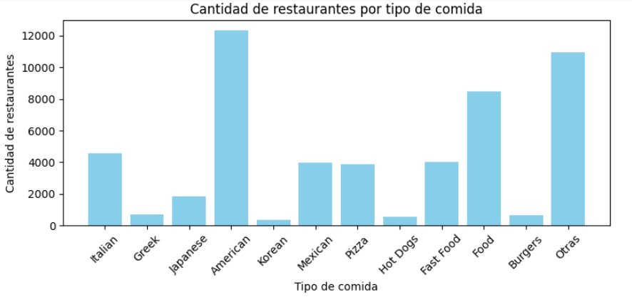
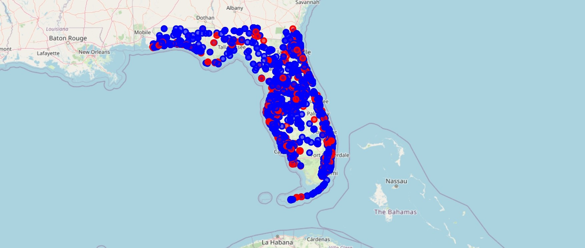

# Proyecto Final Henry - StarSight

## Índice

1. [Integrantes](#Integrantes)
2. [Introduccion a StarSight](#Introducción-a-StarSight)
3. [Desarrollo del proyecto](#Desarrollo-del-proyecto)
4. [Lo que Hacemos](#Lo-que-Hacemos)
5. [Nuestro Modelo](#Nuestro-Modelo)

## Integrantes

- [María José Grecco](https://github.com/mpaezgrecco) - Data Analist
- [Esteban Parron](https://github.com/systemeap) - Data Analist
- [Santiago Mejía](https://github.com) - Data Analist
- [Joaquín Rubiolo](https://github.com/joarubiolo) - Data Scientist
- [Luis Gonzales](https://github.com/lucho28) - Data Engineer

## Introducción a StarSight

En el ámbito de la industria, especialmente en el servicio gastronómico, existe una gran cantidad de negocios que dependen en gran medida de las reseñas de los usuarios en internet. Esto nos abre las puertas a un uso potencial de la información para mejorar sus establecimientos.

Así nace este proyecto, que busca generar información valiosa a partir de las opiniones publicadas en la web, enfocándonos en plataformas como **Yelp** y **Google Maps**. Además, trabajamos en un nicho específico del mercado gastronómico que nos indique el cliente.

  

Para ser más concretos, hemos definido y acotado una base de datos para un análisis más preciso, con el fin de extraer información relevante que potencie su negocio y proporcione una solución certera y confiable.

## Desarrollo del proyecto

Comenzamos identificando las diferentes problemáticas que enfrenta la industria gastronómica con servicio directo al consumidor final. Algunos puntos clave a tener en cuenta son:

- **Análisis de la percepción del cliente**: Interpretación de las impresiones que adquiere el usuario sobre la calidad, servicio u otros aspectos del negocio.
- **Predicción de tendencias de mercado**: Necesidad de anticiparse a cambios y adaptarse rápidamente a las nuevas formas de consumo.
- **Selección de ubicaciones estratégicas**: Identificación de los mejores lugares para abrir nuevos negocios o expandirse.
- **Personalización de la experiencia del usuario**: Fortalecer el vínculo con potenciales clientes a través de la personalización.
- **Alta competencia y mercado saturado**: Dificultad para el desarrollo natural de los negocios debido a la saturación del mercado.

Utilizamos diversas herramientas para abordar estas dificultades, considerando factores del mercado actual, y buscando oportunidades para fortalecer el negocio y evitar amenazas de la competencia.

## Lo que Hacemos

Nuestro equipo tiene la capacidad de generar un análisis detallado de muchos factores dentro de su nicho de mercado. A continuación, mencionamos nuestros aspectos más importantes:

- **Análisis completo** basado en los comentarios y opiniones de los usuarios en plataformas populares como Yelp y Google Maps.
- **Identificación de tendencias** de crecimiento o caídas en el sector gastronómico.
- **Propuesta de las mejores ubicaciones** para nuevos negocios.
  
Desarrollamos un modelo basado en estos puntos clave para optimizar el negocio y evitar gastos innecesarios.

  

  

## Nuestro Modelo
Nuestra base de datos principal proviene de **Yelp** y **Google Maps**. A partir de esta, realizamos un **Análisis de Datos Exploratorio (EDA)** en el que identificamos las variables más relevantes dentro de los comentarios publicados, utilizando librerías como **Pandas** y **Numpy**.

  

El análisis proporciona una visión general del dataset, el cual es limpiado y procesado para obtener métricas básicas. Luego, identificamos factores de interés para profundizar en su análisis. Finalmente, visualizamos los resultados a través de gráficos en **Power BI**. También utilizamos **AWS** para facilitar la disponibilidad de nuestros archivos y automatizar la carga de datos.

  

